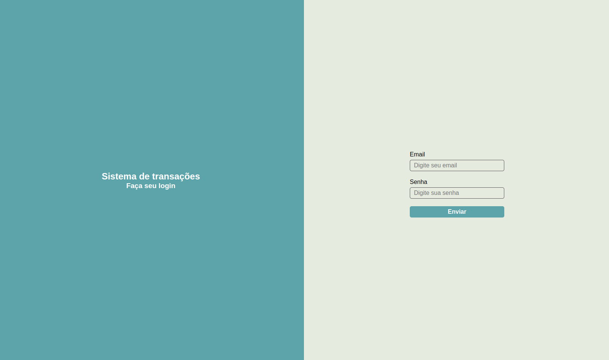

[](https://git.io/typing-svg)
## Descrição
> ### Projeto feito em symfony para aprimorar os conhecimentos e crescer individualmente, o projeto consiste em uma api que simula um sistema de pagamento, onde é possível realizar transações, consultar saldo, consultar transações e realizar transferências entre usuários.

## Tecnologias
> [](#)
[](#)
[](#)
[](#)
[](#)
[](#)
[](#)
[](#)
[](#)
[](#)
[](#)
[](#)
[](#)


## Status do projeto
> ### Finalizado, adicionando novas features.

# Endpoints
> ## Para criar um novo usuário
> >### ```/api/user/post```
> ## Para atualizar a carteira de um usuário
> > ### ```/api/user/update-wallet```
> ## Para listar os usuários cadastrados
> > ### ```/api/users/get```
> ## Para realizar uma transação
> > ### ```/api/transaction/send```
> ## Para se logar na aplicação
> > ### ```/api/login_check```

## Algumas regras da api...

- ### Usuários não logados tem acesso apenas ao endpoint de login e de registro.
- ### Usuários sem saldo suficiente não podem realizar transações.
- ### Usuários lojistas não fazem transferências, apenas usuários comuns.

## Contato
> ### [](https://www.linkedin.com/in/dias-antonio/) [](https://www.instagram.com/noneeeduardo) [](mailto:antoniodias1106@gmail.com)


